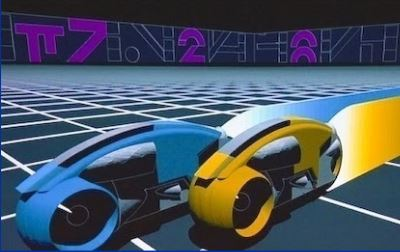

Tron
====   

   

Background: A good game from a bad movie
-----------------------------------------
Tron was a Disney movie that was released in 1982. It was one of the earliest feature films to reflect the video-game craze of the 1980s. Jeff Bridges stars as a computer programmer who becomes part of the very game that he's programming. The game is a "light cycle duel". Your light cycle races across the arena leaving a trail of laser light behind you. Light cycles can only make 90 degree turns. Touching a laser trail destroys a light cycle, so you try to drive your opponents into a light trail while avoiding the trails yourself. (You can watch the [Tron light cycle scene on YouTube](https://www.youtube.com/watch?v=-BZxGhNdz1k)) There are many examples of the tron light cycle game on the internet, one is at [http://www.fltron.com/](http://www.fltron.com/).
 

 
Suggested steps for starting with a single player game
-------------------------------
You may find slides 23 - 38 of the [Functions, Algorithms and Abstractions presentation](https://docs.google.com/presentation/d/12evLVpEOAdoKxIjuTu3OP5GegrFHFTkJHr4dX1lfEow/edit?usp=sharing) and/or [this video](http://youtu.be/5LaX86RCMuQ?hd=1) helpful in completing the following steps.   

1. Move background to `setup()`, declare two variables for `x` and `y` and initialize each to 200. Change the background color to blue, and make a slightly smaller black rectangle inside of it
2. In `draw()` set the `stroke()` to white and then draw a `point()` at (x,y). After that, increase `x` by 1. Run your program. You should see a small white dot in the center of the screen move to the right leaving a trail behind it.
3. Copy the following `notBlack()` function into the bottom of your program. Make sure it not inside the curly braces of another function.
```javascript
function notBlack() {
  let a = get(x, y);
  if (a[0] != 0) return true;
  else if (a[1] != 0) return true;
  else if (a[2] != 0) return true;
  return false;
}
```
4. Declare a `gameOver` variable at the top of your program and intialize it to `false`. 
5. Add an `if` statement to check if `notBlack()` is `true`. If so, display a "GAME OVER" message. and set `gameOver` to `true`.
6. Add another `if` statement about the previous one. If `gameOver` is `true`, then `return;`
7. Replace the code in `draw()` that makes `x` one bigger with four `if` statmeents
+ If `direction` is 37, make `x` smaller by 1 
+ If `direction` is 38, make `y` smaller by 1 
+ If `direction` is 39, make `x` bigger by 1
+ If `direction` is 40, make `y `bigger by 1 
8. Add a `function keyPressed()` that changes `direction` to match `keyCode`. That is:
+ If `keyCode` is 37, set `direction` to 37
+ If `keyCode` is 38, set `direction` to 38
+ If `keyCode` is 39, set `direction` to 39
+ If `keyCode` is 40, set `direction` to 40
9. Run the program. Once a person clicks on the screen, the light cycle should now be able to turn with the arrow keys
10. Add a `mousePressed` function that increases `direction` by 1 with a right click and decreases it by 1 with a left click.
11. At this point you should have a working single player game. You should be able to operate the light cycle with either the keyboard or mouse

Extensions:
-----------
Once you get the basic single player game working, you can start adding other features. Your tron game doesn't have to look or work like any other, have fun and be creative! Possible extensions are:
+ Added graphics for collisions
+ Added obstacles or a maze to make the game more challenging
+ A timer that increases the score the longer the player avoids crashing
+ Turbo mode and/or power ups to move the light cycle faster
+ Self driving mode where like a self driving car the light cycle automatically avoids obstacles
+ A two player game where one person uses the mouse and the other uses the keyboard
+ A computer opponent (or even multiple computer opponents for real craziness!)


Samples of Student Work 
-----------------------
#### (use the left and right mouse buttons to control the light cycle)   
[Marc](https://trinket.io/embed/python/df5a0e966e?outputOnly=true&runOption=run&start=result)   
