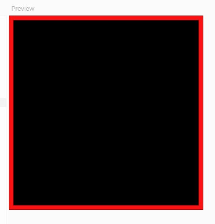
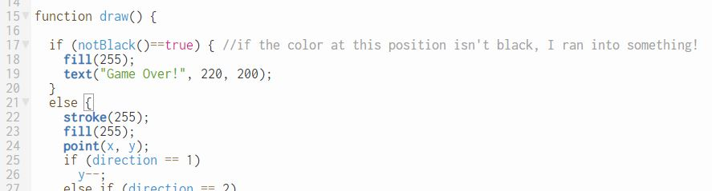

Tron
====
Background: A good game from a bad movie
-----------------------------------------
Tron was a Disney movie that was released in 1982. It was one of the earliest feature films to reflect the video-game craze of the 1980s. Jeff Bridges stars as a computer programmer who becomes part of the very game that he's programming. The game is a "light cycle duel". Your light cycle races across the arena leaving a trail of laser light behind you. Light cycles can only make 90 degree turns. Touching a laser trail destroys a light cycle, so you try to drive your opponents into a light trail while avoiding the trails yourself. (You can watch the [Tron light cycle scene on YouTube](https://www.youtube.com/watch?v=-BZxGhNdz1k)) There are many examples of the tron game on the internet, one is at [http://www.fltron.com/](http://www.fltron.com/).
 

 
Start with a single player game
-------------------------------
1. Start a new program. Save your program with a meaningful name.
2. In `setup()` draw one red rectangle that fills the screen and then a slightly smaller black rectangle inside of it. This  create a border will be the walls that contain the light cycles. Delete the `background()` in `draw()` and run your program. It should look similar to this:   
   
3. Declare three global variables `x`, `y` and `direction`. Initialize `x` and `y` to the center of the screen and `direction` to 1.
3. In `draw()` set the `stroke()` to white and then draw a `point()` at (x,y). Run your program. You should see a small white dot in the center of the screen.
3. Under the other code in `draw()` write four `if` statmeents
+ If `direction` is 1, decrement `y` 
+ If `direction` is 2, increment `x` 
+ If `direction` is 3, increment `y` 
+ If `direction` is 4, decrement `x` 
4. Run the program and we should see a white light cycle trail moving toward the top of the screen. In order to controle the direction of the light cycle add a `function keyPressed()` that contains four `if` statements that check the value stored in `key`.
+ If key means "up", set `direction` to 1
+ If key means "right", set `direction` to 2
+ If key means "down", set `direction` to 3
+ If key means "left", set `direction` to 4
5. Run the program. Once a person clicks on the screen, the light cycle should now be able to turn
6. The game is over when we cross a light cycle trail. To find out if we are touching the trail, we will use add a `notBlack()` function. At the bottom of the program   
```javascript
function notBlack(){
  let a = get(x,y);
  if(a[0] != 0) return true;
  else if(a[1] != 0) return true;
  else if(a[2] != 0) return true;
  return false;
}  
```
7. At this point you should have a working single player game. To end the game if your trail crosses another trail or goes out of bounds add an `if` statement at the top of `draw()` that checks if (x,y) is not black like the one below   
    


 
Then add a computer opponent
----------------------------
You may find slides 374 - 386 of the PythonProcessing PowerPoint helpful in adding a computer opponent.
1. At this point our `draw()` function is getting big and ugly. Once you get the basic single player tron game working, break it up into functions—put the code that moves the Human player in its own `human()` function.
2. Now we can concentrate on the computer. We need a function similar to `human()`, let’s call it `computer()`. We’ll use `human()` as a basis for `computer()`. What will be the same? different?
3. The computer will need its own variables for its position and direction. The direction variable is similar to key in that it could also be a char but it’s not really a key press, it just stores the direction the computer is traveling
4. The problem now is that the computer never changes direction, We need to add code so that if the computer is about to run into a wall, it will change direction. That means changing the computer direction variable (called `compDir` in my program), something like:   
```python
if(compDir == RIGHT):                   # if the computer is moving right
   compX = compX + 1                    # move the computer one pixel right
   if(get(compX+1,compY) != color(0)):  # then look one pixel ahead, will I run into something that isn't black?
      compDir = DOWN                    # turn!
```

Extensions:
-----------
If you have extra time you can add more features to the game to make it more interesting. You can make the line thicker by making the dots with `rect()` instead of `point()`, just make sure to move the x and y coordinates by one more than the size of the rectangle. You'll probably want a variable to hold the size of the dot. You can add extra computer opponents or even another human player. You could start the `frameRate` out at a low value, and increase it as the game progresses to make the light cycles move faster the longer you play. Be creative and have fun, your tron game doesn't have to look or work like any other.

Samples of Student Work 
-----------------------
#### (use the left and right mouse buttons to control the light cycle)   
[Marc](https://trinket.io/embed/python/df5a0e966e?outputOnly=true&runOption=run&start=result)   
